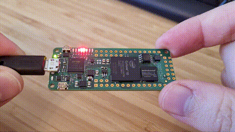

# SPI MASTER AND SLAVE FOR FPGA

The [SPI master](#spi-master) and [SPI slave](#spi-slave) are simple controllers for communication between FPGA and various peripherals via the SPI interface. The SPI master and SPI slave have been implemented using VHDL 93 and are applicable to any FPGA.

**The SPI master and SPI slave controllers support only SPI mode 0 (CPOL=0, CPHA=0)!**

The SPI master and SPI slave controllers were simulated and tested in hardware. I use the GHDL tool for CI: automated VHDL simulations in the GitHub Actions environment ([setup-ghdl-ci](https://github.com/ghdl/setup-ghdl-ci)). If you have a question or an improvement tip, send me an e-mail or create an issue.

## SPI master

### Generics:

```vhdl
CLK_FREQ    : natural := 50e6; -- set system clock frequency in Hz
SCLK_FREQ   : natural := 5e6;  -- set SPI clock frequency in Hz (condition: SCLK_FREQ <= CLK_FREQ/10)
WORD_SIZE   : natural := 8;    -- size of transfer word in bits, must be power of two
SLAVE_COUNT : natural := 1     -- count of SPI slaves
```

### Ports:

```vhdl
CLK      : in  std_logic; -- system clock
RST      : in  std_logic; -- high active synchronous reset
-- SPI MASTER INTERFACE
SCLK     : out std_logic; -- SPI clock
CS_N     : out std_logic_vector(SLAVE_COUNT-1 downto 0); -- SPI chip select, active in low
MOSI     : out std_logic; -- SPI serial data from master to slave
MISO     : in  std_logic; -- SPI serial data from slave to master
-- INPUT USER INTERFACE
DIN      : in  std_logic_vector(WORD_SIZE-1 downto 0); -- data for transmission to SPI slave
DIN_ADDR : in  std_logic_vector(natural(ceil(log2(real(SLAVE_COUNT))))-1 downto 0); -- SPI slave address
DIN_LAST : in  std_logic; -- when DIN_LAST = 1, last data word, after transmit will be asserted CS_N
DIN_VLD  : in  std_logic; -- when DIN_VLD = 1, data for transmission are valid
DIN_RDY  : out std_logic; -- when DIN_RDY = 1, SPI master is ready to accept valid data for transmission
-- OUTPUT USER INTERFACE
DOUT     : out std_logic_vector(WORD_SIZE-1 downto 0); -- received data from SPI slave
DOUT_VLD : out std_logic  -- when DOUT_VLD = 1, received data are valid
```

### Resource usage:

LE | FF | M9K | Fmax
---|----|-----|-----------
34 | 23 | 0   | 330.1 MHz

*Implementation was performed using Quartus Prime Lite Edition 20.1.0 for Intel Cyclone 10 FPGA (10CL025YU256C8G) with default generics.*

### Simulation:

A simulation is prepared in the [```sim/```](sim/) folder. You can use the prepared TCL script to run simulation in ModelSim.
```
vsim -do spi_master_tb_msim_run.tcl
```

Or it is possible to run the simulation using the [GHDL tool](https://github.com/ghdl/ghdl). Linux users can use the prepared bash script to run the simulation in GHDL:
```
./spi_master_tb_ghdl_run.sh
```

## SPI slave

### Generics:

```vhdl
WORD_SIZE : natural := 8; -- size of transfer word in bits, must be power of two
```

### Ports:

```vhdl
CLK      : in  std_logic; -- system clock
RST      : in  std_logic; -- high active synchronous reset
-- SPI SLAVE INTERFACE
SCLK     : in  std_logic; -- SPI clock
CS_N     : in  std_logic; -- SPI chip select, active in low
MOSI     : in  std_logic; -- SPI serial data from master to slave
MISO     : out std_logic; -- SPI serial data from slave to master
-- USER INTERFACE
DIN      : in  std_logic_vector(WORD_SIZE-1 downto 0); -- data for transmission to SPI master
DIN_VLD  : in  std_logic; -- when DIN_VLD = 1, data for transmission are valid
DIN_RDY  : out std_logic; -- when DIN_RDY = 1, SPI slave is ready to accept valid data for transmission
DOUT     : out std_logic_vector(WORD_SIZE-1 downto 0); -- received data from SPI master
DOUT_VLD : out std_logic  -- when DOUT_VLD = 1, received data are valid
```

### Resource usage:

LE | FF | M9K | Fmax
---|----|-----|-----------
29 | 21 | 0   | 324.5 MHz

*Implementation was performed using Quartus Prime Lite Edition 20.1.0 for Intel Cyclone 10 FPGA (10CL025YU256C8G) with default generics.*

### Simulation:

A simulation is prepared in the [```sim/```](sim/) folder. You can use the prepared TCL script to run simulation in ModelSim.
```
vsim -do spi_slave_tb_msim_run.tcl
```

Or it is possible to run the simulation using the [GHDL tool](https://github.com/ghdl/ghdl). Linux users can use the prepared bash script to run the simulation in GHDL:
```
./spi_slave_tb_ghdl_run.sh
```

## Examples:

### Spirit Level:

The [Spirit Level example design](examples/spirit_level) shows one possible use of the SPI Master controller. The example design is prepared for [FPGA board CYC1000](https://shop.trenz-electronic.de/en/TEI0003-02-CYC1000-with-Cyclone-10-FPGA-8-MByte-SDRAM) with Intel Cyclone 10 FPGA (10CL025YU256C8G) and [digital accelerometer (LIS3DH)](https://www.st.com/resource/en/datasheet/lis3dh.pdf). Here you can find [the documentation of the CYC1000 board](https://www.trenz-electronic.de/fileadmin/docs/Trenz_Electronic/Modules_and_Module_Carriers/2.5x6.15/TEI0003/REV02/Documents/CYC1000%20User%20Guide.pdf). In this design, the SPI Master controller is used to configure and read data from the accelerometer. The LEDs on the board show the values from the accelerometer in the form of a spirit level. You can watch the Spirit Level example [video on YouTube](https://youtu.be/EI1BEAkZu5Q).

[](https://youtu.be/EI1BEAkZu5Q)

### SPI loopback:

The [SPI loopback example design](examples/loopback) allows testing transfers between SPI master and SPI slave over external wires. The example design is prepared for FPGA board [EP4CE6 Starter Board](http://www.ebay.com/itm/111975895262) with Altera FPGA Cyclone IV (EP4CE6E22C8), few buttons and a seven-segment display (four digit). You can watch the SPI loopback example [video on YouTube](https://youtu.be/-TbtB6Sm2Xk).

[](https://youtu.be/-TbtB6Sm2Xk)

Display description (from right on board in video):

```
Digit0 = value on SPI slave input
Digit1 = value on SPI slave output
Digit2 = value on SPI master input
Digit3 = value on SPI master output
```

Buttons description (from right on board in video):

```
BTN_ACTION (in mode0) = setup value on SPI slave input
BTN_ACTION (in mode1) = write (set valid) of SPI slave input value
BTN_ACTION (in mode2) = setup value on SPI master input
BTN_ACTION (in mode3) = write (set valid) of SPI slave input value and start transfer between SPI master and SPI slave
BTN_MODE = switch between modes (mode0 = light decimal point on digit0,...)
BTN_RESET = reset FPGA design
```

## License:

This whole repository (include SPI master and SPI slave controllers) is available under the MIT license. Please read [LICENSE file](LICENSE).
